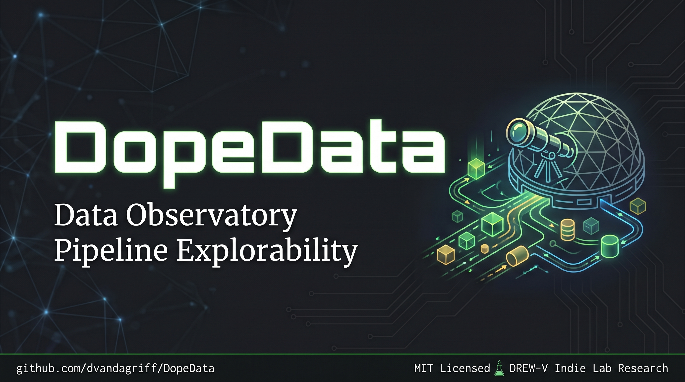
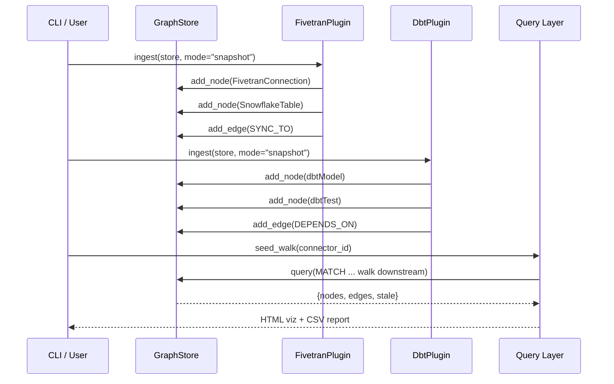

<div align="right">
  <sup><em>DREW-V Indie Lab Research · MIT Licensed</em></sup>
</div>

<br>

<div align="center">



# DopeData

### Pipeline Observability for the Modern Data Stack

<!-- BADGE ROW -->


**Fivetran &rarr; dbt lineage tracking · Business-day freshness intelligence · Zero-cloud, zero-lock-in**

[⚡ Quick Start](#-quick-start) · [📐 Architecture](#-architecture) · [🔌 Plugins](#-plugin-system) · [🧪 Testing](#-testing)

</div>

<br>

---

## &nbsp;&#128300;&nbsp; What Is DopeData?

DopeData is a **local-first, zero-dependency pipeline observability toolkit** that maps your Fivetran &rarr; Snowflake &rarr; dbt data lineage into a queryable graph — and tells you whether your data is fresh according to business calendars, not just wall-clock timestamps.

It answers three questions every data team faces:

| Question | DopeData Answer |
| :--- | :--- |
| **&ldquo;If this pipeline breaks, what breaks downstream?&rdquo;** | Graph-based seeded lineage walks from connector to dashboard &mdash; full impact surface in seconds. |
| **&ldquo;Is my data stale or just weekend-late?&rdquo;** | Business-day-aware staleness checks that account for weekends *and* US federal holidays. |
| **&ldquo;Can I run this without a cloud API key?&rdquo;** | Snapshot mode ingests local CSV/JSON — no credentials, no accounts, no vendor lock-in. Go. |

> [!NOTE]
> DopeData works at `0.1` maturity. It is a working prototype built for indie research and learning. The code is clean, the tests pass, and the demo script shows the full stack in under 30 seconds. **It is not production-ready — but it is production-plausible.**

<div align="center">
<table>
<tr><th>Metric</th><th>Status</th></tr>
<tr><td>Python packages required (core)</td><td>&#128994; Zero — pure Python stdlib for the core graph engine</td></tr>
<tr><td>Test coverage</td><td>&#128994; pytest suite with dedicated freshness, lineage, graph, and plugin tests</td></tr>
<tr><td>Licensing</td><td>&#128994; MIT — do whatever you want</td></tr>
<tr><td>Optional backend</td><td>&#128994; Kùzu embedded graph DB for full Cypher support (opt-in)</td></tr>
</table>
</div>

---

## &nbsp;&#128640;&nbsp; Quick Start

### Prerequisites

| Requirement | Version |
|:---|:---|
| Python | `>=3.10` |
| uv (recommended) | Latest from <https://docs.astral.sh/uv/> |

### Install

```sh
git clone https://github.com/dvandagriff/DopeData.git
cd DopeData
uv sync --all-extras --dev
```

### Run the Demo

One command loads snapshot fixtures, builds a graph, walks lineage from every connector, and writes HTML visualizations + freshness reports:

```sh
make demo
# or directly:
uv run python scripts/run_demo.py
```

Expected output files appear in `data/snapshots/`:

- `lineage.html` — interactive Cytoscape.js graph visualization
- `freshness_report.csv` — tabular staleness report per node

### CLI Reference

```sh
# Walk lineage from a specific connector
uv run dope seed-walk --seed stripe

# Walk all connectors, output HTML + CSV report
uv run dope scan --all-connectors --view all

# Override the "as-of" date (e.g., test Monday morning freshness)
uv run dope scan --seed random_words --as-of 2026-08-17

# Use Kùzu backend for full Cypher queries
uv run dope seed-walk --seed stripe --backend kuzu
```

---

## &nbsp;&#129504;&nbsp; Architecture

DopeData follows a **plugin-driven, graph-first** architecture:



### Graph Schema

The entire data pipeline is modeled as a directed graph. Six node types and six edge types capture the full Fivetran &rarr; dbt flow:

```mermaid
erDiagram
    FivetranConnection {
        string id PK
        string source_id
        string name
        string status
        timestamp synced_at
    }
    SnowflakeTable {
        string id PK
        string database
        string schema_name
        string table_name
        int64 row_count
    }
    dbtModel {
        string id PK
        string package_name
        string name
        string type
        string materialization
    }
    dbtTest {
        string id PK
        string model_id
        string name
        string status
    }
    dbtSource {
        string id PK
        string package_name
        string name
        string database
        string schema_name
    }
    DataProduct {
        string id PK
        string name
        string description
    }

    FivetranConnection ||--|o SYNC_TO : syncs to SnowflakeTable
    SnowflakeTable ||--|o FEEDS : feeds DataProduct
    dbtModel ||--|o DEPENDS_ON : depends on dbtModel
    dbtModel ||--|o PRODUCES : produces SnowflakeTable
    dbtTest ||--|o TESTS : tests dbtModel
    DataProduct ||--|o EXPOSED_BY : exposed by dbtModel
```

<details>
<summary><b>&#128295;&nbsp; Node &amp; Edge Type Reference</b></summary>

| Node Type | Description |
|:---|:---|
| `FivetranConnection` | A connector instance (Stripe, Salesforce, etc.) |
| `SnowflakeTable` | Target warehouse table with row count / size metadata |
| `dbtModel` | A dbt model — staging, intermediate, fact, dimension, etc. |
| `dbtTest` | Test assertion running against a model |
| `dbtSource` | Fivetran-synced source model in dbt manifest |
| `DataProduct` | Upstream consumer (Power BI dashboard, API endpoint, ML model) |

| Edge Type | Direction | Meaning |
|:---|:---|:---|
| `SYNC_TO` | Connector &rarr; Table | Fivetran syncs rows into this table |
| `PRODUCES` | Model &rarr; Table | dbt materializes this table |
| `DEPENDS_ON` | Model &rarr; Model | Transformation dependency chain |
| `TESTS` | Test &rarr; Model | Test belongs to a model |
| `FEEDS` | Table &rarr; Product | Table feeds downstream consumer |
| `EXPOSED_BY` | Product &rarr; Model | Product depends on upstream model |

</details>

### Backend Options

| Backend | Engine | Cypher Support | Install |
|:---|:---|:---|:---|
| **PurePyGraph** (default) | In-memory Python dict-based graph | Subset (`MATCH`, `WHERE`, `RETURN`) | Zero deps |
| **Kùzu** | Embedded C++ graph DB on-disk/in-memory | Full Cypher 5.0 subset | `uv add dope[kuzu]` |

---

## &nbsp;&#129302;&nbsp; Plugin System

DopeData uses a plugin architecture for data ingestion. Each plugin knows how to fetch, transform, and load external data into the graph store.

### Available Plugins

<details>
<summary><b>&#128640;&nbsp; FivetranPlugin</b></summary>

Ingests Fivetran connector metadata and schema information from local snapshot CSV/JSON files:

- Reads `fivetran_connections.csv` — connector IDs, source types, sync status, timestamps
- Reads `fivetran_schemas.csv` — table destinations (database, schema, name)
- Reads `fivetran_dbt_bridge.csv` — maps Fivetran tables to dbt sources
- Creates `FivetranConnection`, `SnowflakeTable` nodes and `SYNC_TO` edges

```python
from dope.core.plugin import load_plugins
from dope.plugins.fivetran import FivetranPlugin

store = make_backend("pure")
plugin = FivetranPlugin(snapshot_dir="data/snapshots")
plugin.ingest(store, mode="snapshot")
```

</details>

<details>
<summary><b>&#128300;&nbsp; DbtPlugin</b></summary>

Ingests dbt manifest and run-results JSON:

- Reads `dbt_nodes.json` — model graph, types, materializations, dependencies
- Reads `dbt_run_results.json` — test statuses, durations, execution timestamps
- Creates `dbtModel`, `dbtTest`, `dbtSource` nodes and `DEPENDS_ON`, `TESTS`, `PRODUCES` edges

```python
from dope.plugins.dbt import DbtPlugin

store = make_backend("pure")
plugin = DbtPlugin(snapshot_dir="data/snapshots")
plugin.ingest(store, mode="snapshot")
```

</details>

### Building Your Own Plugin

Subclass `PipelinePlugin` and implement the `ingest` method:

```python
from dope.core.plugin import PipelinePlugin

class MyCustomPlugin(PipelinePlugin):
    def ingest(self, store, mode: str = "snapshot"):
        # Fetch data from your source
        # Call store.add_node() and store.add_edge()
        pass
```

---

## &nbsp;&#128203;&nbsp; Freshness Intelligence

DopeData's staleness engine doesn't just check timestamps — it understands **business calendars**. A pipeline that ran last Friday is not stale on Monday morning if no business day has been missed.

### The Rule

```
stale(LastRunEnd, AsOf) ≡ LastRunEnd < LastBusinessDay(AsOf)
```

Where `LastBusinessDay` walks backwards from the reference date skipping weekends and US federal holidays.

### Example Walkthrough

| Scenario | Result | Why |
|:---|:---|:---|
| Synced Aug 14 (Friday), checked Aug 17 (Monday) | &check; Fresh | Last biz day = Aug 14, data is current |
| Synced Aug 10 (Monday), checked Aug 17 | &#10060; Stale | 5 business days behind |
| Last run = `None` | &#10060; Stale | Pipeline never ran |
| Synced on a holiday | &#128161; Edge case | Compare date directly against last biz day |

### Configurable Holidays

The 2026 US federal holidays are hardcoded in `src/dope/core/freshness.py`. For production use, swap in the [`holidays`](https://github.com/vacanza/holidays) library:

```python
import holidays
US_HOLIDAYS = frozenset(holidays.US(years=range(2024, 2031)).keys())
```

Full freshness specification is documented in [`docs/FRESHNESS_RULE.md`](docs/FRESHNESS_RULE.md).

---

## &nbsp;&#128193;&nbsp; Project Structure

```
dope/
├── LICENSE                    # MIT License (do whatever)
├── Makefile                   # demo / test / live / clean / format / lint
├── pyproject.toml             # hatchling build, uv sync target
├── uv.lock                    # deterministic dependency lockfile
│
├── src/dope/                  # Package source
│   ├── cli/main.py            # CLI entry point (argparse)
│   ├── core/
│   │   ├── graph.py           # PurePyGraph — pure-Python graph engine
│   │   ├── kuzu_backend.py    # Kùzu backend + factory function
│   │   ├── freshness.py       # Business-day staleness logic
│   │   ├── plugin.py          # PipelinePlugin base class
│   │   └── schema.py          # NodeType enum, EdgeType, CYPHER_DDL
│   ├── plugins/
│   │   ├── fivetran.py        # Fivetran snapshot ingestion
│   │   └── dbt.py             # dbt manifest + run-results ingestion
│   └── query/
│       ├── lineage.py         # Seeded walk — full downstream traversal
│       ├── freshness_report.py# Staleness report generator (CSV)
│       └── viz.py             # Cytoscape.js HTML visualizer
│
├── data/snapshots/            # Demo fixtures (CSV + JSON)
│   ├── fivetran_connections.csv
│   ├── fivetran_schemas.csv
│   ├── fivetran_dbt_bridge.csv
│   ├── dbt_nodes.json
│   └── dbt_run_results.json
│
├── scripts/                   # Demo & utility scripts
│   ├── run_demo.py            # Full pipeline: ingest → walk → report → viz
│   ├── seed_walk_demo.py      # Minimal 4-line lineage walkthrough
│   └── export_snapshots.py    # Live API snapshot exporter (requires credentials)
│
├── tests/                     # pytest suite
│   ├── test_graph.py          # PurePyGraph correctness
│   ├── test_lineage.py        # Seeded walk coverage
│   ├── test_freshness.py      # Business-day edge cases
│   ├── test_plugins.py        # Plugin ingestion logic
│   └── smoke_test_plugins.py  # Quick sanity checks
│
└── docs/                      # Deep-dive architecture docs
    ├── BUILD_DIRECTIVE.md     # Project spec + acceptance criteria
    ├── ARCHITECTURE.md        # System design & data flow
    └── FRESHNESS_RULE.md      # Staleness calculation specification
```

---

## &nbsp;&#127990;&nbsp; Testing

```sh
# Run full suite
make test
# or: uv run pytest tests/ -v

# Run with coverage (if you add the plugin)
uv run pytest tests/ --cov=dope --cov-report=term-missing
```

---

## &nbsp;&#127891;&nbsp; Contributing

This is an indie research project — contributions are welcome in any form:

- **Bug reports** and feature requests via GitHub Issues
- **Pull requests** for plugins, bug fixes, or documentation
- **Questions** about the architecture (I write detailed docs)

Please ensure `make lint` and `make test` pass before submitting. Code style is enforced by [Ruff](https://docs.astral.sh/ruff/) with mypy type checking.

---

## &nbsp;&#128222;&nbsp; License

MIT License — see [`LICENSE`](LICENSE) for the full text.

> Permission is hereby granted, free of charge, to any person obtaining a copy of this software and associated documentation files (the "Software"), to deal in the Software without restriction.

In other words: **take it, break it, ship it, be dope about it.**

---

<div align="center">

&#127744; &nbsp;Built with obsession, curiosity, and too much caffeine&nbsp; &#127744;

[![][back-to-top]](#top) · [GitHub](https://github.com/dvandagriff/DopeData)

</div>

[back-to-top]: https://img.shields.io/badge/-BACK_TO_TOP-151515?style=flat-square
