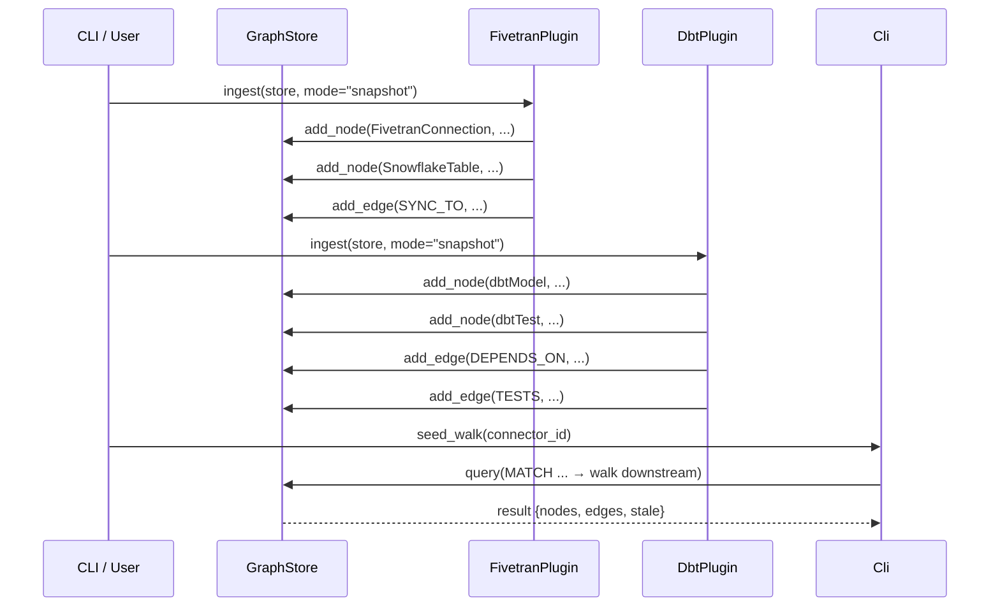

# Dope Architecture

## Overview

`dope` (my-Pipeline-Observability) is a lightweight, zero-dependency pipeline observability toolkit for tracking Fivetran → dbt data lineage and freshness. It provides:

- **Graph-based lineage**: A minimal graph store (PurePyGraph or Kùzu-backed) with Cypher subset query support.
- **Plugin-based ingestion**: `FivetranPlugin` and `DbtPlugin` load snapshot CSV/JSON files into the graph.
- **Business-day freshness**: Staleness checks that account for weekends and US holidays.
- **CLI interface**: Single-command lineage walks, report generation, and HTML visualisation.
- **Demo scripts**: One-shot demos showing the full pipeline from ingestion to output.

## Graph Schema

The graph stores nodes and directed edges. Node types are defined by `NodeType` in `src/dope/core/schema.py`.

```mermaid
erDiagram
    FivetranConnection {
        string id PK
        string source_id
        string name
        string status
        timestamp synced_at
    }
    SnowflakeTable {
        string id PK
        string database
        string schema_name
        string table_name
        int64 row_count
    }
    dbtModel {
        string id PK
        string package_name
        string name
        string type
        string materialization
    }
    dbtTest {
        string id PK
        string model_id
        string name
        string status
    }
    dbtSource {
        string id PK
        string package_name
        string name
        string database
        string schema_name
    }
    DataProduct {
        string id PK
        string name
        string description
    }

    FivetranConnection ||--o{ SYNC_TO : syncs to
    SnowflakeTable ||--o{ FEEDS : feeds
    dbtModel ||--o{ DEPENDS_ON : depends on
    dbtModel ||--o{ PRODUCES : produces
    dbtTest ||--o{ TESTS : tests
    DataProduct ||--o{ EXPOSED_BY : exposed by
```

### Node Types

| Type              | Description                                  |
|-------------------|----------------------------------------------|
| `FivetranConnection` | A Fivetran connector instance.            |
| `SnowflakeTable`      | A target table in the data warehouse.        |
| `dbtModel`           | A dbt model (staging, intermediate, fact, etc.). |
| `dbtTest`            | A dbt test running against a model.         |
| `dbtSource`          | A Fivetran-synced source table model.       |
| `DataProduct`        | An upstream data product or exposure (e.g., Power BI dashboard). |

### Edge Types

| Edge      | From              | To               | Meaning                      |
|-----------|-------------------|------------------|------------------------------|
| `SYNC_TO`     | FivetranConnection | SnowflakeTable  | Connector syncs to this table. |
| `PRODUCES`    | dbtModel/dbtSource | SnowflakeTable | Model materialises this table. |
| `DEPENDS_ON`  | dbtModel         | dbtModel         | Dependency between models.   |
| `TESTS`       | dbtTest          | dbtModel         | Test belongs to a model.     |
| `FEEDS`       | SnowflakeTable   | DataProduct      | Table feeds a data product.  |
| `EXPOSED_BY`  | DataProduct      | dbtModel         | Product depends on a model.  |

## Plugin Ingestion Flow



## Directory Structure

```
src/dope/
├── __init__.py            # Package init, exports core types
├── cli/
│   └── main.py            # CLI entry point (argparse-based)
├── core/
│   ├── graph.py           # PurePyGraph implementation
│   ├── kuzu_backend.py    # Kùzu backend (optional)
│   ├── freshness.py       # Business-day staleness logic
│   ├── plugin.py          # PipelinePlugin base class
│   └── schema.py          # NodeType, EdgeType, CYPHER_DDL
├── plugins/
│   └── __init__.py        # FivetranPlugin, DbtPlugin
└── query/
    └── __init__.py         # (reserved for future query helpers)

data/snapshots/            # Static CSV/JSON fixtures
scripts/                   # Demo scripts
tests/                     # pytest test suite
docs/                      # Architecture docs
```

## CLI Commands

```bash
# Run seed walk for a single connector
python -m dope.cli.main --seed stripe

# Walk all connectors, output HTML + tabular report
python -m dope.cli.main --all-connectors --view all

# Override freshness date (e.g., test on Monday morning)
python -m dope.cli.main --seed random_words --as-of 2026-08-17

# Use Kùzu backend for full Cypher support
python -m dope.cli.main --seed stripe --backend kuzu
```
